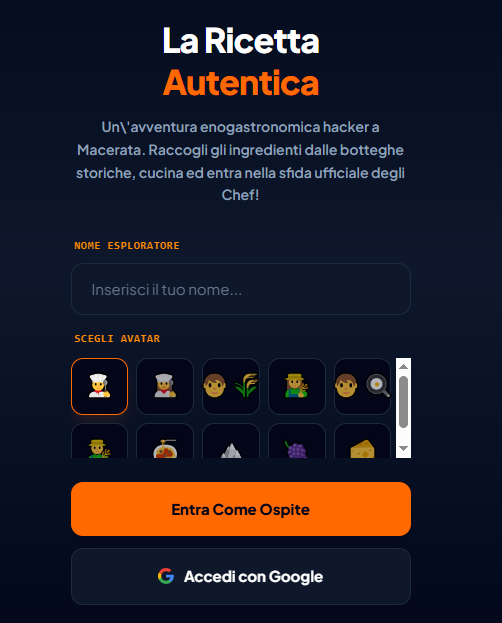
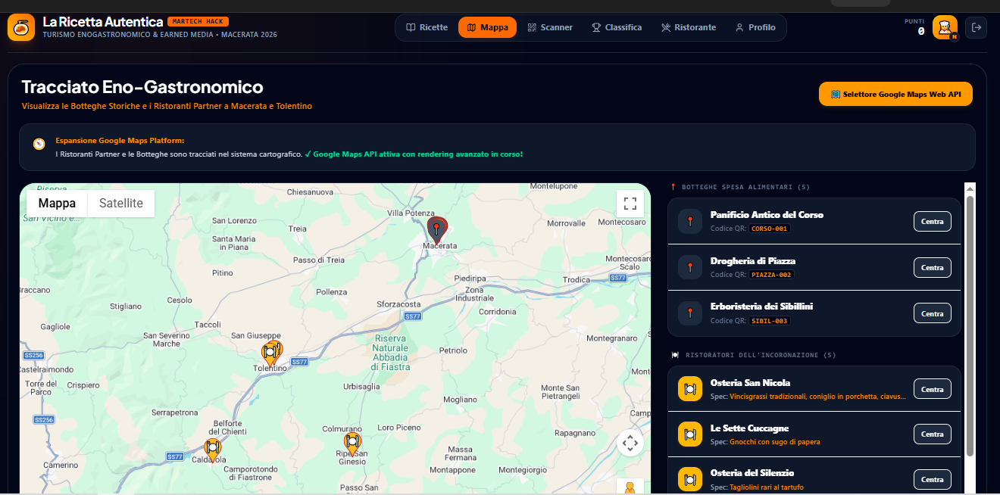
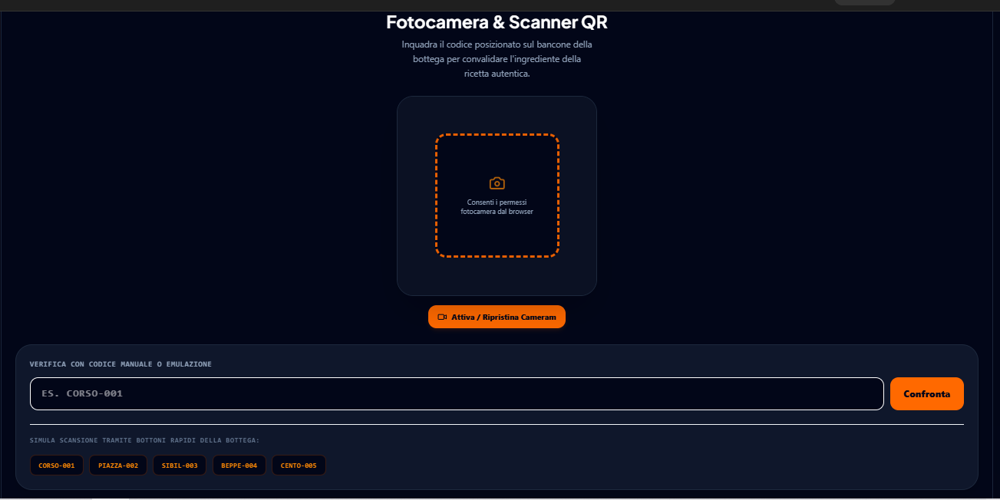
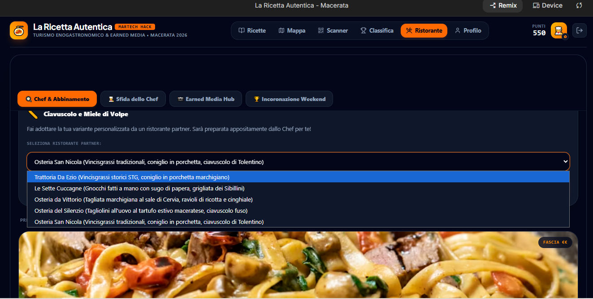
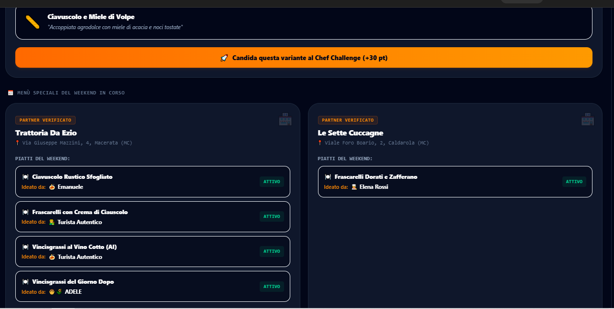
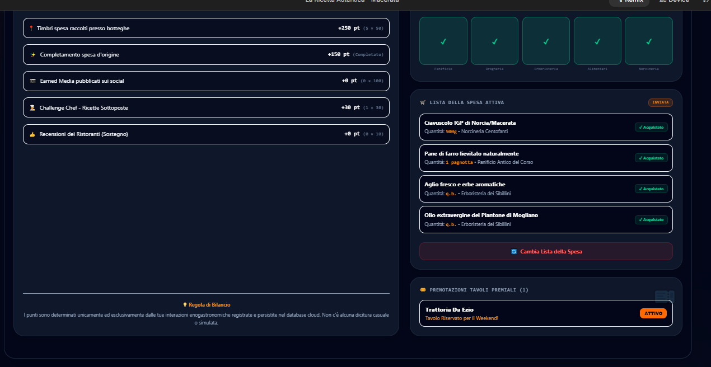

# 🍳 La Ricetta Autentica - MarTech Hack Macerata 2026

> Un'avventura enogastronomica interattiva a Macerata e Tolentino. Raccogli gli ingredienti nelle botteghe storiche, cucina, prenota e partecipa alla sfida ufficiale degli Chef!

---

## 📌 Indice
1. [Visione del Progetto](#-visione-del-progetto)
2. [Flusso Utente & Funzionalità Core](#-flusso-utente--funzionalità-core)
3. [Stack Tecnologico](#-stack-tecnologico)
4. [Architettura del Database (Firebase Firestore)](#-architettura-del-database-firebase-firestore)
5. [Installazione e Configurazione](#-installazione-e-configurazione)
6. [Sicurezza e Best Practices](#-sicurezza-e-best-practices)
7. [Sviluppi Futuri & Note di Release](#-sviluppi-futuri--note-di-release)

---

## 🌟 Visione del Progetto

**La Ricetta Autentica** è un'applicazione web full-stack sviluppata per promuovere il turismo enogastronomico locale attraverso la gamification. L'applicazione unisce i turisti, le botteghe storiche e i ristoranti partner in un'esperienza interattiva a premi. 

Attraverso una mappa interattiva, l'acquisizione di timbri tramite codici QR e la personalizzazione guidata delle ricette tipiche (come i *Vincisgrassi* o i *Frascarelli*), l'utente accumula punti per scalare la classifica e prenotare un tavolo speciale nei migliori ristoranti del weekend.

---

## 📸 Galleria dell'Applicazione

### 1. Onboarding e Selezione Avatar
L'utente può accedere come ospite o autenticarsi in modo sicuro con il proprio account Google, scegliendo un nome e un avatar personalizzato.


### 2. Tracciato Eno-Gastronomico (Mappa Interattiva)
Integrazione avanzata con Google Maps per localizzare in tempo reale le botteghe storiche e i ristoranti partner a Macerata e Tolentino.


### 3. Fotocamera e Scanner QR
Emulazione e scansione reale dei codici QR presenti sui banconi delle botteghe per convalidare l'acquisto degli ingredienti tipici.


### 4. Gestione Proposte Chef & Menu Partner
Proponi la tua variante culinaria allo Chef di un ristorante partner o visualizza i menu speciali attivi per il weekend.


### 5. Menu Speciali del Weekend & Candidature
Visualizzazione dinamica ed elegante delle ricette adottate dai ristoranti con sistema di limitazione delle schede espandibili.


### 6. Profilo Personale & Audit Trasparenza Punti
Il centro di controllo del giocatore: visualizzazione dei timbri acquisiti, dei punti totalizzati, della lista della spesa attiva e dei biglietti di prenotazione dei tavoli.


---

## 🛠️ Flusso Utente & Funzionalità Core

### 1. Cucina Macerata (Scheda Ricette)
- Scegli tra le ricette tradizionali della tradizione maceratese.
- **Creazione Lista della Spesa**: Invia gli ingredienti necessari direttamente alla tua lista attiva. *Regola di Integrità:* È possibile inviare solo una lista alla volta per evitare abusi. Per cambiarla, l'utente deve resettarla esplicitamente dal proprio Profilo.
- **Personalizzazione Chef AI (Sospesa)**: Questa funzione è attualmente disattivata lato client (`🔒 Personalizza con AI - Disattivato`) per garantire un'esperienza di gioco equa e controllata durante l'evento, pronta per essere riabilitata come feature Premium.

### 2. Mappa & Geolocalizzazione
- Visualizzazione dei punti di interesse (Botteghe e Ristoranti).
- Centratura dinamica con focus immediato sulle coordinate dell'attività commerciale selezionata.

### 3. Scanner QR Botteghe
- Scansiona il codice QR univoco di ciascuna bottega (es. `CORSO-001`, `PIAZZA-002`, `SIBIL-055`).
- Sblocca il rispettivo ingrediente nella lista della spesa.
- Guadagna **+50 punti** per ogni timbro collezionato e **+150 punti extra** al completamento dell'intera spesa d'origine.

### 4. Sfida dello Chef & Votazione
- **Proposta di adozione**: Puoi proporre una sola ricetta a un ristorante del weekend.
- **Voto Unico per Ristoranti**: Per garantire una competizione onesta e trasparente, ogni utente registrato ha a disposizione **un solo voto totale** da esprimere tra tutti i ristoranti candidati.
- **Voto Unico Challenge Ricette**: È consentito **un solo voto di gradimento totale** anche per le creazioni culinarie dei candidati in gara.

### 5. Profilo & Trasparenza Log
- Visualizzazione in tempo reale dello stato d'acquisto di ciascun ingrediente (sincronizzato con i timbri delle botteghe).
- **Pannello di Audit dei Punti**: Storico dettagliato e trasparente di come sono stati accumulati i punti.
- **Cambia Lista della Spesa**: Pulsante di reset sicuro che permette di cancellare la lista attiva e ricominciare con una nuova ricetta.

---

## 💻 Stack Tecnologico

L'applicazione sfrutta un'architettura moderna, resiliente e altamente performante:

- **Frontend**: React 18+ con Vite (TypeScript per la massima robustezza tipologica).
- **Stato Globale**: Redux Toolkit (`@reduxjs/toolkit`) per la gestione sincronizzata e pulita dei dati di gioco (punti, timbri, carrello spesa).
- **Styling**: Tailwind CSS per un design responsive, fluido, con tema dark professionale e minimalista.
- **Animazioni**: Framer Motion (`motion/react`) per micro-interazioni, transizioni fluide delle schede e feedback visivi premium.
- **Database & Auth**: Firebase (Firestore per i dati in tempo reale e Firebase Authentication per la gestione degli accessi tramite Google o Ospite).
- **Mappe**: Integrazione diretta con Google Maps Platform.

---

## 🗄️ Architettura del Database (Firebase Firestore)

Tutte le logiche di sincronizzazione sono implementate in modo persistente in Firestore. Di seguito lo schema delle collezioni principali:

### 1. Collezione `users`
Ogni documento corrisponde all'ID dell'utente autenticato (`uid`):
```json
{
  "name": "Emanuele",
  "avatar": "👨‍🍳",
  "points": 550,
  "stamps": ["shop1", "shop2", "shop3", "shop4", "shop5"],
  "badge": "Oro",
  "bookedRestaurants": ["rest1"],
  "votedSubmissions": ["sub_id_123"],
  "votedRestaurants": ["rest2"],
  "shoppingCart": [
    { "id": "ing1", "name": "Farina di stocco", "shopId": "shop1", "qty": "250g" }
  ]
}
```

### 2. Collezione `challenge_submissions`
Contiene le ricette candidate create dagli utenti per la Chef Challenge:
```json
{
  "id": "sub_id_123",
  "recipeId": "vincisgrassi",
  "variantName": "Vincisgrassi al Vino Cotto",
  "creatorId": "user_uid_xyz",
  "creatorName": "Elena Rossi",
  "creatorAvatar": "👩‍🍳",
  "votes": 12,
  "createdAt": "2026-06-23T10:00:00Z"
}
```

### 3. Collezione `restaurants`
Stato dei ristoranti partner e dei piatti da loro adottati per il weekend:
```json
{
  "id": "rest1",
  "name": "Trattoria Da Ezio",
  "address": "Via Giuseppe Mazzini, 4, Macerata (MC)",
  "adoptedRecipes": [
    {
      "recipeId": "ciauscolo",
      "variantName": "Ciavuscolo Rustico Sfogliato",
      "touristId": "user_uid_abc",
      "touristName": "Emanuele",
      "touristAvatar": "👨‍🍳",
      "featurerId": "user_uid_abc"
    }
  ]
}
```

---

## 🚀 Installazione e Configurazione

### Prerequisiti
Assicurati di avere installato sul tuo sistema:
- **Node.js** (versione 18 o superiore)
- **npm** (incluso in Node.js)

### Passaggi per il deployment locale

1. **Clona il repository**:
   ```bash
   git clone <url-del-tuo-nuovo-repo-privato>
   cd la-ricetta-autentica
   ```

2. **Installa le dipendenze**:
   ```bash
   npm install
   ```

3. **Configura le variabili d'ambiente**:
   Crea un file `.env` nella directory radice copiando il modello di esempio:
   ```bash
   cp .env.example .env
   ```
   *Nota: Inserisci le tue chiavi API personali per Google Maps e Firebase all'interno del file `.env`.*

4. **Avvia il server di sviluppo**:
   ```bash
   npm run dev
   ```
   L'applicazione sarà accessibile localmente all'indirizzo `http://localhost:3000`.

5. **Compila per la produzione**:
   ```bash
   npm run build
   ```

---

## 🛡️ Sicurezza e Best Practices

- **Separazione delle Chiavi**: Tutte le chiavi API sensibili sono gestite tramite variabili d'ambiente in conformità con gli standard di sicurezza moderni. Non memorizzare mai le chiavi API direttamente nel codice sorgente committato.
- **Regole di Sicurezza Firestore (`firestore.rules`)**: Le operazioni di scrittura sui punteggi, sui voti e sulle prenotazioni sono verificate per impedire la manipolazione dei dati da parte di utenti non autorizzati.
- **Controlli di Integrità Single-Vote**: Sia lato client che lato database, sono presenti controlli che inibiscono l'invio multiplo di schede voto o di inserimento piatti.

---

## 📈 Sviluppi Futuri & Note di Release

### Modifiche Implementate nell'ultima sessione:
- **🔒 Disattivazione AI Menu**: Il pulsante di personalizzazione automatica tramite AI è stato disabilitato per focalizzare l'evento sul recupero delle ricette storiche della tradizione e prevenire allucinazioni culinarie automatiche non riproducibili dagli Chef reali.
- **🛒 Integrità Lista Spesa**: Risolto il problema del duplicato della lista della spesa. Ora la lista inviata viene protetta. La modifica e la selezione di una nuova ricetta con relativa lista ingredienti sono permesse solo attraverso il pulsante esplicito **"Cambia Lista della Spesa"** posizionato all'interno della scheda **Profilo**.
- **📂 Sincronizzazione Cloud**: Integrazione e sincronizzazione immediata della lista della spesa attiva sul database Firestore dell'utente, garantendo il ripristino istantaneo dello stato anche ricaricando la pagina o accedendo da un altro dispositivo.
- **🗳️ Ottimizzazione Weekend Menu**: Aggiunto un comodo pulsante "Mostra Altri / Mostra Meno" nella visualizzazione dei piatti del weekend, limitando la visualizzazione iniziale a un massimo di 5 piatti per non sovraccaricare l'interfaccia.

---

*Fatto con ❤️ per valorizzare la tradizione gastronomica di Macerata e Tolentino.*
